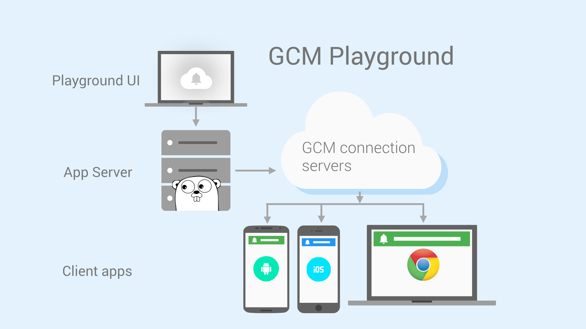

GCM Playground
============

A reference implementation of a [GCM Application Server](https://developers.google.com/cloud-messaging/server#role) in the form of a playground that developers can use to test the Google Cloud Messaging Service.

Introduction
------------

GCM Playground can be used to experiment sending and receiving messages with the [Google Cloud Messaging](https://developers.google.com/cloud-messaging) API. The playground can be used as a sample implementation of the GCM App Server, that you can use as a reference for your own app server implementation.

#### What's Included

- **App Server (`server/`)**: Written in Go (Golang) is a [GCM Application Server](https://developers.google.com/cloud-messaging/server#role).
- **Playground UI (`web/`)**: Made with Polymer, it is the main component that you will for sending downstream messages and receiving upstream messages.
- **Client apps (`android/`, `chrome/`, `web/`)**: These client apps are used in conjunction with the playground UI to test various features of the GCM API.

Pre-requisites
--------------

- Learn more about [Google Cloud Messaging](https://developers.google.com/cloud-messaging)
- Watch the ["Re-engage your users with GCM notifications"](https://www.youtube.com/watch?v=HxbidYYAek8) DevByte video 

Getting Started
---------------

#### Configuration

Before you can start using the GCM Playground you need to configure a project and create credentials for access:

1. Follow [this link to get a configuration file](https://developers.google.com/mobile/add) to use GCM.
  - If you want to use the Android client, configure your app to use `com.google.samples.apps.gcmplayground` for the package name. You can use a different package name if you want,
  but then you have to adapt the source code of the Android client accordingly. At the end of the configuration flow, download the configuration file to the `android/app` folder.
  - If you want to use the iOS client, use the bundle ID of an app that has the Push Notifications feature enabled, and upload its Development SSL Certificate when requested to do so. At the end of the configuration flow, download the configuration file to your machine.
  - If you want to use the Chrome App, just configure the project to use an Android client.

2. After you enable Cloud Messaging, the configuration flow shows you your values of `Server API Key` `and SenderId`. Replace the placeholders value in `server/server.go` with the value you obtained:

`server/server.go`

    // API key from Cloud console
    apiKey = ""

    // GCM sender ID
    senderId = ""

`web/app/settings.json`

You should only need to change the IP address here. Replace `192.168.99.100` with the IP address that `docker-machine ls` gives you.

    "main": {
      "sendMessageEndpoint": "http://192.168.99.100:4260/message",
      "clientsEndpoint": "http://192.168.99.100:4260/clients",
      "socketEndpoint": "http://192.168.99.100:4260/"
    },

#### Installation - App Server and Playground UI

- Install [Docker](https://docs.docker.com/installation/), [Docker Compose](https://docs.docker.com/compose/install/), and if using on a Mac [Docker Machine](https://docs.docker.com/machine/install-machine/).
- Install [Node.js](https://nodejs.org/download/) >=0.12.0.
- Clone this repo.
- `$ ./start.sh`

If the last command fails, you might need to give execute permission to the script. Do `$ chmod +x start.sh` and retry.

#### Accessing services - App Server and Playground UI

If using docker machine, run `docker-machine ls` to find out the VM IP address.

The ports that are being used are:

- **`3000` - Playground Web UI**
- `4260` - App server

So if your IP is `192.168.99.100`, load `192.168.99.100:3000` in the browser of the computer running docker to access the Playground UI.

If you want to access the Playground Web UI using a mobile client instead of the computer running docker, you need to tunnel the app server traffic so it's accessible via the public network. To do that, download [ngrok](https://ngrok.com) and run `$ ./ngrok http <IP ADDRESS>:4260`. Alternatively, you could also deploy the playground on any public cloud and use the server's address.

Android App
------------

Included in `android/` is an Android app that can help you get started with the playground. The Android app lets you:

- Register and unregister the client with the backend.
- Receive messages sent through the playground.
- Subscribe to topics using Pubsub.
- Send upstream messages.

#### Getting Started

- Open Android Studio.
- Select **File > Open**, browse to where you cloned the gcm-playground repository, and open the android folder (if you are in the Android Studio start screen, you can select **Open an existing Android Studio project** and use this same path).
- Make sure that the configuration file is in the right place. Check the **Configuration** section above for instructions.

#### Usage
- Run the sample on your Android device.
- Provide a string identifier for your device (e.g. "My Nexus5"), and click **REGISTER**.
- Use the playground web UI to send a message to the registered device.
- A notification containing the GCM message should be displayed on the device.

iOS App
------------

Included in `ios/` is an iOS app that can help you get started with the playground. The iOS app lets you:

- Register and unregister the client with the backend.
- Receive messages sent through the playground.
- Subscribe to topics using Pubsub.
- Send upstream messages.

#### Getting Started

- If you don't have CocoaPods installed on your machine, follow [the instructions](https://developers.google.com/ios/cocoapods) and istall it.
- Open a terminal window and navigate to the `gcm-playground/ios` folder and run `pod install`.
- Run `open GCM Playground.xcworkspace` to open the project in xcode.
- In xcode, replace the project bundle ID with the bundle ID that you have used in the configuration flow.
- In xcode, add the configuration file previously downloaded to the `GCM Playground` target. Check the **Configuration** section above for instructions.

#### Usage

- Run the sample on your iOS device.
- Provide a string identifier for your device (e.g. "My iphone6"), and click **Register**.
- Use the playground web UI to send a message to the registered device.
- A notification containing the GCM message should be displayed on the device.

Note: You need Swift 2.0 to run the app.

Chrome App
-----------

Included in `chrome/` is a Chrome app that can help you get started with the playground. The Chrome app lets you:

- Register the client with the backend
- Receive messages sent through the playground

#### Usage

- Open Chrome and go to menu > **Tools > Extensions**.
- Click **Developer mode > Load unpacked extensions...**
- Browse to and **Select** the `chrome/` folder.
- On the Extensions page, **Launch** GCM Playground Receiver app.

Support
-------

- Stack Overflow: http://stackoverflow.com/questions/tagged/google-cloud-messaging

If you've found an error in this sample, please file an issue: https://github.com/googlesamples/gcm-playground/issues

Patches are encouraged, and may be submitted by forking this project and submitting a pull request through GitHub.

License
-------

Copyright 2015 Google, Inc.

Licensed to the Apache Software Foundation (ASF) under one or more contributor
license agreements.  See the NOTICE file distributed with this work for
additional information regarding copyright ownership.  The ASF licenses this
file to you under the Apache License, Version 2.0 (the "License"); you may not
use this file except in compliance with the License.  You may obtain a copy of
the License at

  http://www.apache.org/licenses/LICENSE-2.0

Unless required by applicable law or agreed to in writing, software
distributed under the License is distributed on an "AS IS" BASIS, WITHOUT
WARRANTIES OR CONDITIONS OF ANY KIND, either express or implied.  See the
License for the specific language governing permissions and limitations under
the License.
