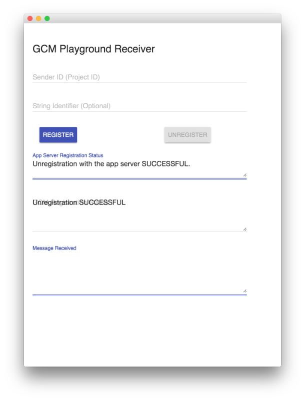
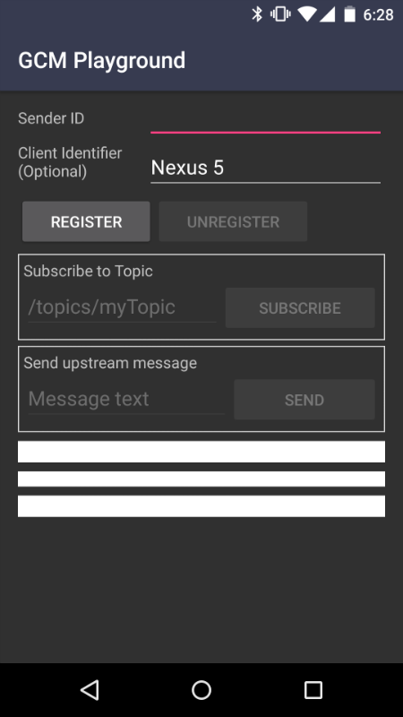
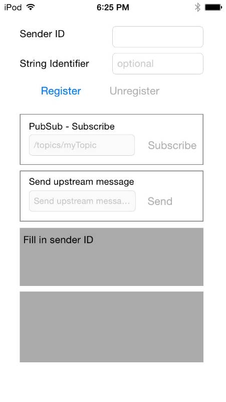

GCM Playground
============

A reference implementation of a [GCM Application Server](https://developers.google.com/cloud-messaging/server#role) in the form of a playground that developers can use to test the Google Cloud Messaging Service.

Introduction
------------

GCM Playground can be used to experiment sending and receiving messages with the [Google Cloud Messaging](https://developers.google.com/cloud-messaging) API. The playground can be used as a sample implementation of the GCM App Server, that you can use as a reference for your own app server implementation.

#### What's Included

- **App Server (`server/`)**: Written in Go (Golang) is a [GCM Application Server](https://developers.google.com/cloud-messaging/server#role).
- **Playground UI (`web/`)**: Made with Polymer, it is the main component that you will for sending downstream messages and receiving upstream messages.
- **Client apps (`android/`, `chrome/`, `web/`)**: These client apps are used in conjunction with the playground UI to test various features of the GCM API.

Pre-requisites
--------------

- Learn more about [Google Cloud Messaging](https://developers.google.com/cloud-messaging/gcm)

#### Set Up an API Project and Credentials

- Follow [this link to Google Developers Console](https://console.developers.google.com/flows/enableapi?apiid=googlecloudmessaging) create a project with Google Cloud Messaging enabled.
- You can create a new project here, or choose an existing project to enable GCM in.
- Once the project has been created, you can find your project ID and project number on the **Home** page of the project. For example, **Project Number: 670330094152**.
- Copy down your project number. You will use it later on as the [GCM sender ID](https://developers.google.com/cloud-messaging/gcm.html#senderid).

Getting Started
---------------

#### Installation

- Install [Docker](https://docs.docker.com/installation/), [Docker Compose](https://docs.docker.com/compose/install/), and if using on a Mac [Docker Machine](https://docs.docker.com/machine/install-machine/).
- Install [Node.js](https://nodejs.org/download/) >=0.12.0.
- Clone this repo.
- `$ ./start.sh`

If the last command fails, you might need to give execute permission to the script. Do `$ chmod +x start.sh` and retry.

#### Accessing services

If using docker machine, run `docker-machine ls` to find out the VM IP address.

If using boot2docker, run `$ boot2docker ip` to find out the VM IP address. Usually, the IP is `192.168.59.103`.

The ports that are being used are:

- **`3000` - Playground Web UI**
- `4260` - App server

When using mobile app clients, you would want to tunnel the app server traffic so it's accessible via the public network. To do that, download [ngrok](https://ngrok.com) and run `$ ./ngrok http <IP ADDRESS>:4260`. Optionally, you can also deploy the playground on any public cloud and use the server's address.

#### Configuration

The following must be set before you can start using the GCM Playground:

- Login to your [Google Developers Console](https://console.developers.google.com)
- In the sidebar, under **APIs & Auth**, click on **Credentials**.
- Then generate an **API Key**. Make sure it's a Server Key.

`server/server.go`

    // API key from Cloud console
    apiKey = ""

    // GCM sender ID
    senderId = ""

`web/app/settings.json`

You should only need to change the IP address here. Replace `192.168.59.103` with the IP address that `docker-machine ls` or `boot2docker ip` gives you.

    "main": {
      "sendMessageEndpoint": "http://192.168.59.103:4260/message",
      "clientsEndpoint": "http://192.168.59.103:4260/clients",
      "socketEndpoint": "http://192.168.59.103:4260/"
    },

Chrome App
-----------

Included in `chrome/` is a Chrome app that can help you get started with the playground. The Chrome app lets you:

- Register the client with the backend
- Receive messages sent through the playground

#### Usage

- Open Chrome and go to menu > **Tools > Extensions**.
- Click **Developer mode > Load unpacked extensions...**
- Browse to and **Select** the `chrome/` folder.
- On the Extensions page, **Launch** GCM Playground Receiver app.

Android App
------------

Included in `android/` is an Android app that can help you get started with the playground. The Android app lets you:

- Register and unregister the client with the backend
- Receive messages sent through the playground
- Subscribe to topics using Pubsub
- Send upstream messages

#### Usage

- Follow the [quickstart guide](https://developers.google.com/cloud-messaging/) to set up your project in Android Studio.
- Run the sample on your Android device.
- Use the playground web UI to send a message to the registered device.
- A notification containing the GCM message should be displayed on the device.

iOS App
------------

Included in `ios/` is an iOS app that can help you get started with the playground. The iOS app lets you:

- Register and unregister the client with the backend
- Receive messages sent through the playground
- Subscribe to topics using Pubsub
- Send upstream messages

#### Usage

- Follow the [quickstart guide](https://developers.google.com/cloud-messaging/ios/start) to set up your project in XCode.
- Run the sample on your iOS device.
- Use the playground web UI to send a message to the registered device.
- A notification containing the GCM message should be displayed on the device.

Note: You need Swift 1.2 to run the app.

Support
-------

- Stack Overflow: http://stackoverflow.com/questions/tagged/google-cloud-messaging

If you've found an error in this sample, please file an issue: https://github.com/googlesamples/gcm-playground/issues

Patches are encouraged, and may be submitted by forking this project and submitting a pull request through GitHub.

License
-------

Copyright 2015 Google, Inc.

Licensed to the Apache Software Foundation (ASF) under one or more contributor
license agreements.  See the NOTICE file distributed with this work for
additional information regarding copyright ownership.  The ASF licenses this
file to you under the Apache License, Version 2.0 (the "License"); you may not
use this file except in compliance with the License.  You may obtain a copy of
the License at

  http://www.apache.org/licenses/LICENSE-2.0

Unless required by applicable law or agreed to in writing, software
distributed under the License is distributed on an "AS IS" BASIS, WITHOUT
WARRANTIES OR CONDITIONS OF ANY KIND, either express or implied.  See the
License for the specific language governing permissions and limitations under
the License.
>>>>>>> master
